# 🎭 Theatre Ticket Booking System  

## [🌐 Live Demo Here!!!! <- Click me](https://react-5-movieticket.onrender.com/)  
!!!!! add /admin to browse admin dashboard. You can set up seatLayout Showtime and so on there !

---

A full-stack theatre ticket booking application with separate **client** and **admin** sides. Built using **React (Vite, Tailwind)** for the frontend, **Express.js** for the backend, **MongoDB (Mongoose)** as the database, **Clerk** for authentication, and **Stripe** for payments.  

---

## ✨ Features  

### 🎟 Client Side  
- Browse films currently in theatres  
- Watch trailers of popular films 
- View showtimes and available seats  
- Book tickets with seat selection  
- Secure payment checkout via **Stripe**  
- User login/signup via **Clerk**  

### 🛠 Admin Side  
- Manage films and showtimes  
- Allocate seat maps for different screens  
- Customize hero section on homepage  

---

## 🗂 Page Details  

### 🎟 Client Pages  

#### 🏠 Home Page
- **Function:** Browse films currently in theatres, watch trailers, and see featured movies.  
- **Screenshot:**  
  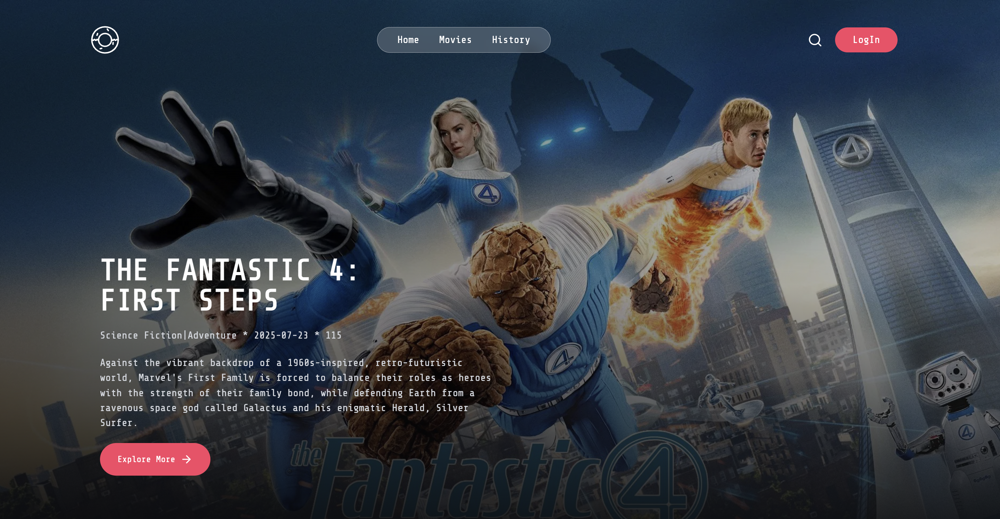  
  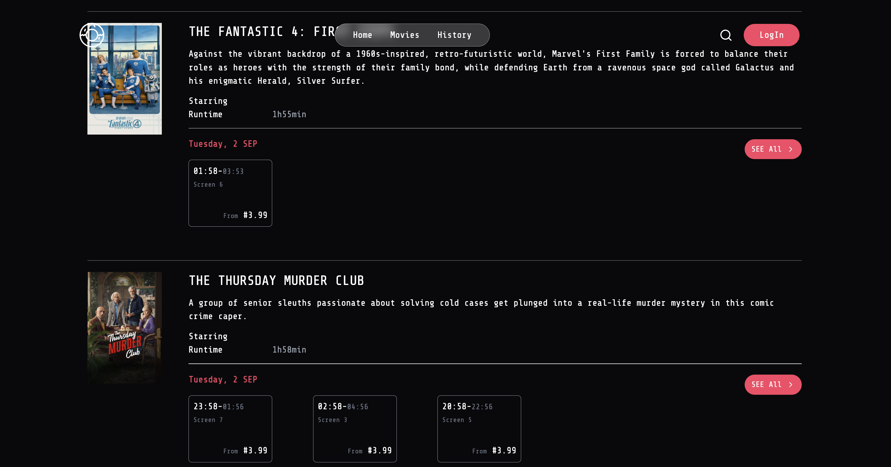  
  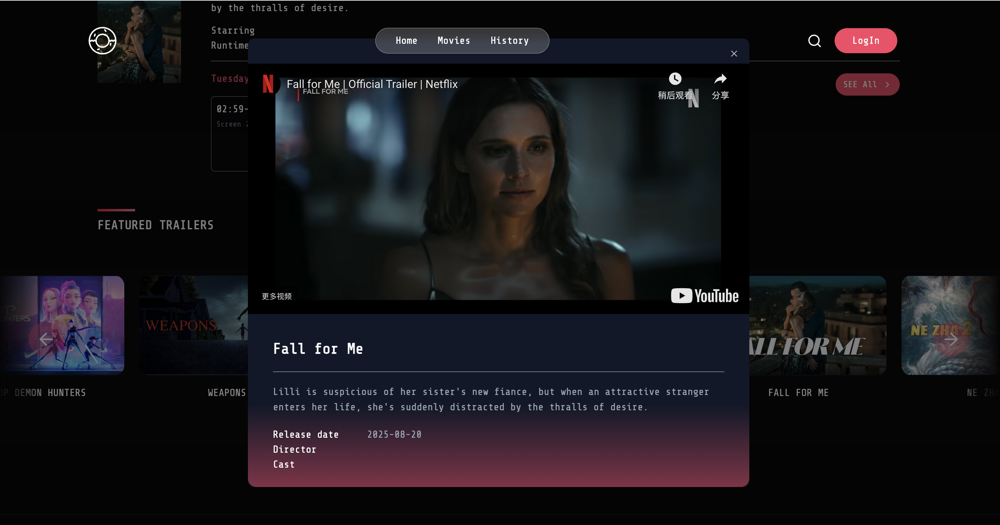  

#### 🎬 All Films Page
- **Function:** View a list of all available films.  
- **Screenshot:**  
  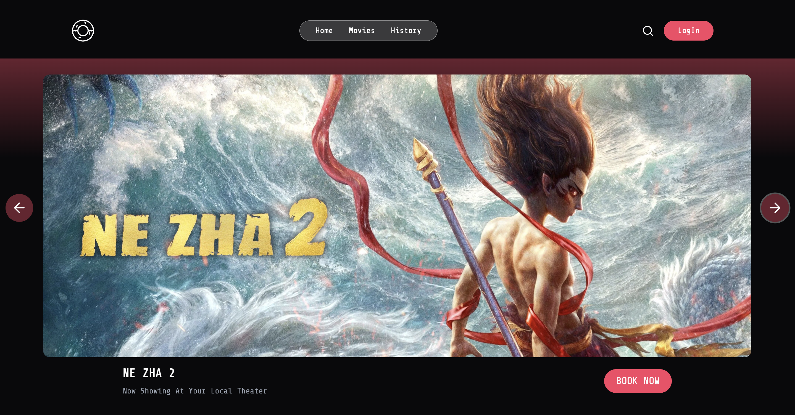  
  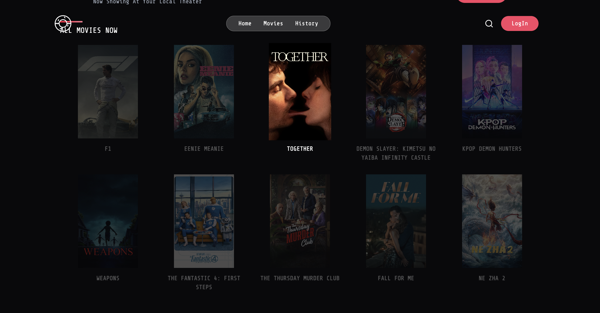  

#### 📄 Film Detail Page
- **Function:** See detailed information about a film, including director, casts and all available showtimes.  
- **Screenshot:**  
  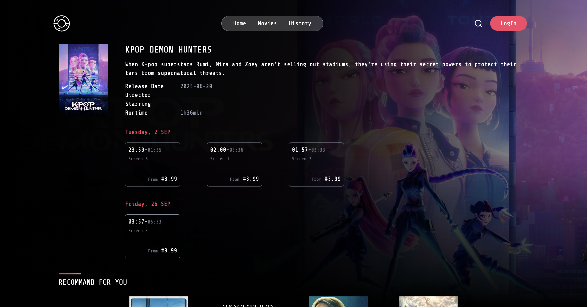  

#### 💺 Seat Selection & Checkout Page
- **Function:** Choose your seats, view pricing, and complete secure payments via Stripe.  
- **Screenshot:**  
  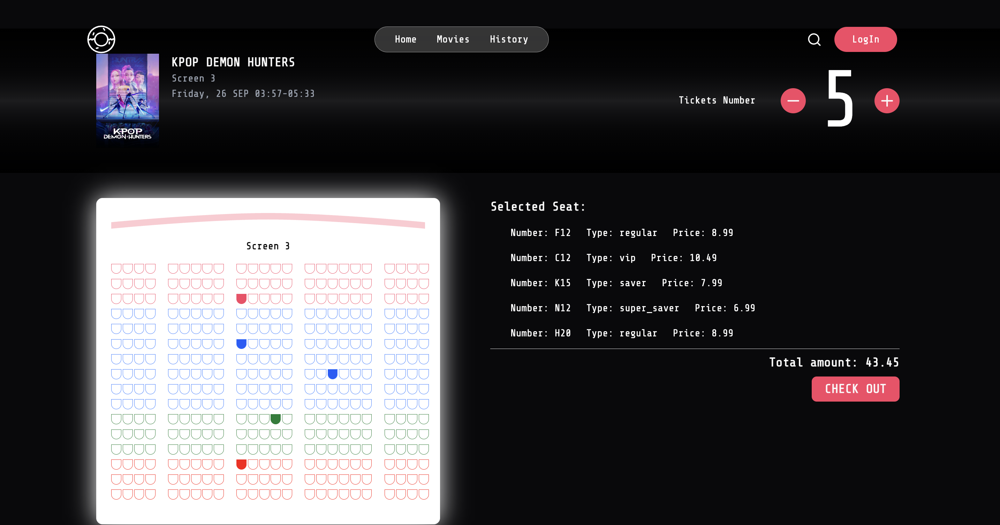  
  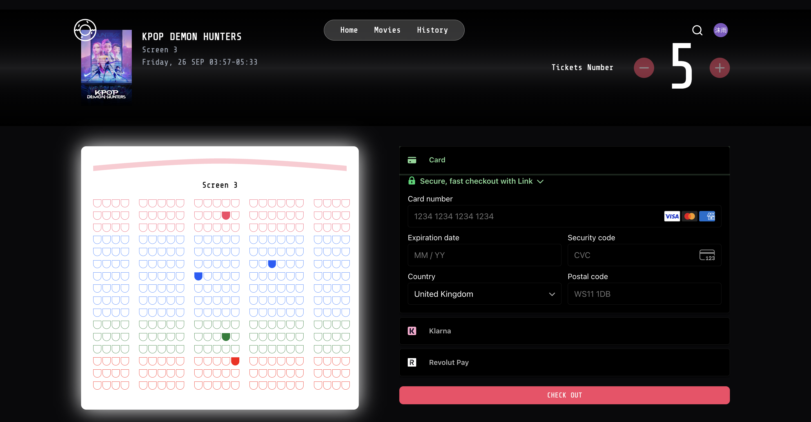  

#### 📜 History Page
- **Function:** View past bookings and ticket history for the logged-in user.  
- **Screenshot:**  
  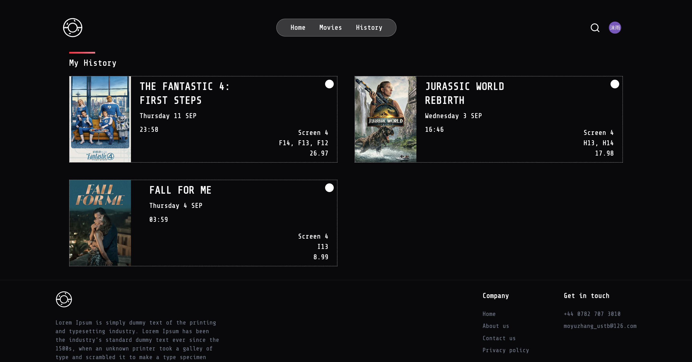  

---

### 🛠 Admin Pages  

#### 📊 Films Dashboard
- **Function:** Overview of current films, bookings, and quick management actions.  
- **Screenshot:**  
  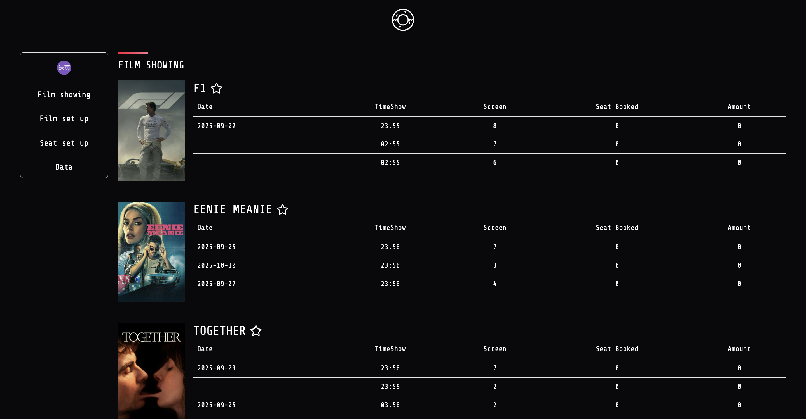  

#### 🕒 Manage Showtimes Page
- **Function:** Add or edit showtimes for different films and screens.  
- **Screenshot:**  
  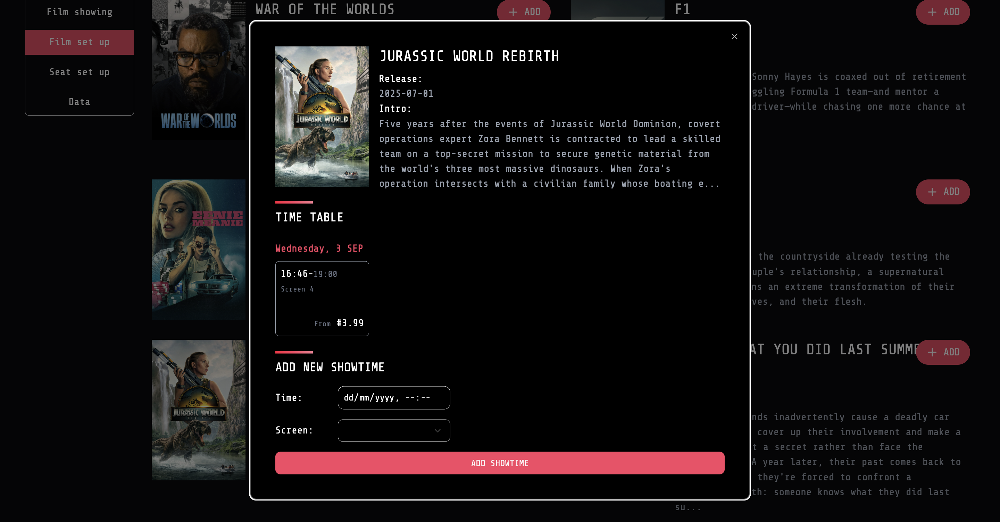  

#### 🪑 SeatLayout Allocation Page
- **Function:** Allocate and customize seat layouts for different theatre screens.  
- **Screenshot:**  
  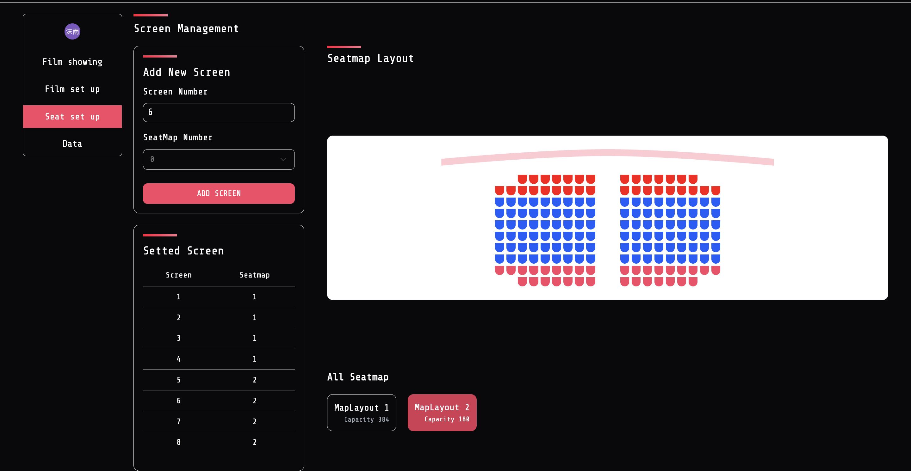  

---

## 🖼️ Tech Stack  

- **Frontend:** Vite, React, Tailwind CSS  
- **Backend:** Express.js, Node.js  
- **Database:** MongoDB (Mongoose)  
- **Integrations:** Clerk (authentication), Stripe (payments)  

---

## 🚀 Demo  

🔗 [Live Website](https://react-5-movieticket.onrender.com/)  

---

## 📂 Project Structure  

```plaintext
React_5_movieTicket/
├── backend/                 # Backend (Express.js + Mongoose)
│   ├── config/              # Database & stripe setting & environment configuration
│   ├── controllers.js/      # Controllers for handling requests
│   ├── data/                # SeatLayout data
│   ├── models/              # Mongoose models
│   ├── routes.js/           # API routes
│   ├── service/             # Business logic and service layer
│   ├── utils/               # Utility functions
│   └── server.js            # Backend entry point
│
├── frontend/                # Frontend (React + Vite + Tailwind)
│   ├── public/              # Static public assets
│   └── src/                 # Source code for the frontend
│       ├── assets/          # Local images, icons, etc.
│       ├── components/      # Reusable UI components
│       ├── config/          # Frontend configuration files (stripe)
│       ├── lib/             # External libraries/helpers
│       ├── pages/           # Page-level components (routes)
│       ├── utils/           # Utility functions
│       ├── App.jsx          # Main React app component
│       ├── index.css        # Global styles
│       └── main.jsx         # Frontend entry point
│
├── .gitignore
├── README.md
├── package.json             # Root dependencies
├── package-lock.json

```

---

## ⚙️ Installation & Setup  

### 1. Clone the repo  
```bash
git clone https://github.com/acse-mz223/React_5_movieTicket.git
cd React_5_movieTicket
```

### 2. Install dependencies  
- Frontend  
  ```bash
  cd frontend
  npm install
  ```
- Backend  
  ```bash
  npm install
  ```

### 3. Set up environment variables  

**Frontend (`frontend/.env`)**  
```env
VITE_CLERK_PUBLISHABLE_KEY=<your_clerk_frontend_api>
VITE_STRIPE_PUBLISHABLE_KEY=<your_stripe_publishable_key>
```

**Backend (`.env`)**  
```env
CLERK_PUBLISHABLE_KEY=<your_clerk_publishable_key>
CLERK_SECRET_KEY=<your_clerk_secret_key>
MONGO_URL=<your_mongodb_connection_string>
NODE_ENV=development
PORT=<your_server_port>
STRIPE_SECRET_KEY=<your_stripe_secret_key>
TMDB_API_KEY=<your_tmdb_api_key>
TMDB_API_READ_ACCESS_TOKEN=<your_tmdb_api_read_access_token>

```

### 4. Run the app locally  
- Backend  
  ```bash
  npm run dev
  ```
- Frontend  
  ```bash
  cd frontend
  npm run dev
  ```

By default:  
- Frontend → `http://localhost:5173`  
- Backend → `http://localhost:5001`  

---

## 🔮 Future Enhancements  
- Email notifications for bookings  
- Analytics for theatre managers  

---

## 🤝 Contributing  
Contributions are welcome! Fork the repo, open an issue, or submit a pull request.  

---

## 📜 License  
This project is licensed under the **MIT License**.  
